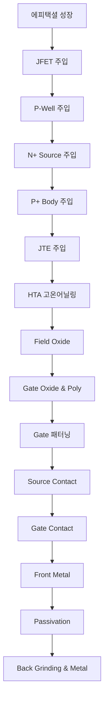

# 📚 SiC Power MOSFET 공정 완전 가이드 - 목차

## 🎯 학습 목표
이 가이드는 SiC Power MOSFET 제조 공정을 체계적으로 학습할 수 있도록 구성되었습니다. 반도체 공정을 처음 배우는 분들도 쉽게 이해할 수 있도록 각 단계별 원리와 실무 노하우를 제공합니다.

---

## 📋 공정 플로우 개요

---

## 📖 Phase별 상세 가이드

### 🔴 **Phase 1: Ion Implantation (이온 주입)**
> 반도체의 전기적 특성을 결정하는 핵심 도핑 공정

| 순서 | 공정명 | 파일 | 핵심 내용 | 학습 난이도 |
|------|--------|------|-----------|------------|
| 1 | **JFET Region** | [[3.0 JFET]] | 주 전류 경로 형성 | ⭐⭐⭐ |
| 2 | **P-Well Formation** | [[5.0 PWELL]] | 채널 영역 생성 | ⭐⭐⭐⭐ |
| 3 | **N+ Source** | [[6.0 NPLUS]] | 소스 영역 형성 | ⭐⭐⭐ |
| 4 | **P+ Body Contact** | [[7.0 PPLUS]] | 바디 컨택 영역 | ⭐⭐⭐ |
| 5 | **JTE Formation** | [[9.0 JTE]] | 내압 향상 구조 | ⭐⭐⭐⭐⭐ |

**💡 학습 포인트**: 
- SiC의 높은 활성화 에너지 이해
- Hot implant의 중요성
- 하드 마스크 공정의 핵심 역할

---

### 🔥 **Phase 2: Thermal Processing (열처리)**
> 도펀트 활성화 및 결정 회복의 핵심 공정

| 순서 | 공정명 | 파일 | 핵심 내용 | 학습 난이도 |
|------|--------|------|-----------|------------|
| 6 | **High Temperature Annealing** | [[11.5 HTA]] | 도펀트 활성화 | ⭐⭐⭐⭐⭐ |
| 7 | **Field Oxide** | [[11.0 Field Oxide]] | 절연 영역 형성 | ⭐⭐ |

**💡 학습 포인트**:
- 극고온(1600-1800°C) 공정의 도전과제
- 카본 캡을 이용한 표면 보호 기술
- Si 승화 방지 전략

---

### 🚪 **Phase 3: Gate Formation (게이트 형성)**
> MOSFET의 제어 전극 및 절연막 형성

| 순서 | 공정명 | 파일 | 핵심 내용 | 학습 난이도 |
|------|--------|------|-----------|------------|
| 8 | **Gate Oxide & Poly Depo** | [[11.5 Gox 및 GPoly Depo]] | 게이트 스택 | ⭐⭐⭐⭐ |
| 9 | **Gate Patterning** | [[13.0 GPoly]] | 게이트 전극 패터닝 | ⭐⭐⭐ |

**💡 학습 포인트**:
- SiC/SiO₂ 계면의 특수성
- ONO/OHNO 처리로 계면 개선
- 채널 이동도 최적화

---

### 🔌 **Phase 4: Contact & Metallization (컨택 및 금속화)**
> 전기적 연결 및 배선 형성

| 순서 | 공정명 | 파일 | 핵심 내용 | 학습 난이도 |
|------|--------|------|-----------|------------|
| 10 | **Source Contact Opening** | [[17.0 SCONT]] | 소스 컨택홀 | ⭐⭐⭐ |
| 11 | **Gate Contact Opening** | [[21.0 GCONT]] | 게이트 컨택홀 | ⭐⭐ |
| 12 | **Front Metal Formation** | [[23.0 Front Metal]] | 1차 금속 배선 | ⭐⭐⭐ |
| 13 | **Passivation** | [[25.0 Passivation]] | 보호막 형성 | ⭐⭐ |

**💡 학습 포인트**:
- 고종횡비 컨택홀의 균일한 식각
- 실리사이드를 통한 컨택 저항 최소화
- 스텝 커버리지 확보 기술

---

### ⚙️ **Phase 5: Backside Processing (후면 공정)**
> 최종 성능 최적화 공정

| 순서 | 공정명 | 파일 | 핵심 내용 | 학습 난이도 |
|------|--------|------|-----------|------------|
| 14 | **Back Grinding & Metal** | [[50.0 BGBM]] | 웨이퍼 박막화 및 후면 전극 | ⭐⭐⭐⭐ |

**💡 학습 포인트**:
- 레이저 어닐링을 통한 실리사이드 형성
- 카본 클러스터 방지 기술
- 박막 웨이퍼의 취급 주의사항

---

## 🎓 학습 로드맵

### 📝 **초급자 (반도체 기초 학습자)**
1. **공정 개요 이해** (1-2주)
   - 전체 플로우 파악
   - 기본 용어 학습
   - SiC vs Si 특성 차이

2. **핵심 공정 집중** (2-3주)
   - [[3.0 JFET]] - 이온 주입 기초
   - [[11.0 Field Oxide]] - 간단한 절연 공정
   - [[23.0 Front Metal]] - 금속화 기초

3. **점진적 확장** (3-4주)
   - 나머지 공정들 순차 학습
   - 공정간 연관성 이해

### 🔬 **중급자 (반도체 경험자)**
1. **SiC 특성 집중** (1주)
   - [[11.5 HTA]] - 고온 공정의 도전과제
   - [[5.0 PWELL]] - 채널 엔지니어링

2. **핵심 기술 심화** (2-3주)
   - [[9.0 JTE]] - 내압 설계 이론
   - [[50.0 BGBM]] - 후면 공정 최적화

3. **통합 이해** (1-2주)
   - 공정간 상호작용
   - 품질 관리 체계

### ⚡ **고급자 (전문가)**
1. **최신 기술 동향** (지속적)
   - 차세대 공정 기술
   - AI/머신러닝 적용
   - 공정 최적화 방법론

---

## 📊 핵심 성능 지표

### 🎯 **목표 사양**
| 파라미터 | 목표값 | 측정 방법 | 관련 공정 |
|----------|--------|-----------|----------|
| **온저항** | <10 mΩ·cm² | 전기적 측정 | 전체 공정 |
| **내압** | >1200V | 고전압 시험 | JTE 설계 |
| **채널 이동도** | >100 cm²/Vs | Hall 측정 | P-Well, Gate |
| **컨택 저항** | <10⁻⁶ Ω·cm² | TLM 측정 | Silicide |
| **활성화율** | >90% | SIMS, Hall | HTA |

### 📈 **품질 관리 체계**
- **SPC (Statistical Process Control)**: Cp, Cpk > 1.33
- **DOE (Design of Experiments)**: 공정 최적화
- **FMEA (Failure Mode Analysis)**: 위험도 평가
- **6-sigma**: 품질 수준 향상

---

## 🔧 실무 활용 가이드

### 💼 **업무별 활용법**

#### **공정 엔지니어**
- 각 공정의 핵심 파라미터 숙지
- 불량 발생시 원인 분석 방법
- 공정 최적화 접근법

#### **품질 엔지니어**
- 측정 방법 및 분석 기술
- 통계적 공정 관리 방법
- 고객 요구사항 대응

#### **개발 엔지니어**
- 설계와 공정의 상관관계
- 신기술 도입 검토 포인트
- TCAD 시뮬레이션 연계

#### **생산 관리자**
- 공정 플로우 최적화
- 수율 향상 방안
- 원가 절감 포인트

### 🔍 **문제 해결 접근법**

#### **Step 1: 현상 파악**
- 불량 유형 분류
- 발생 패턴 분석
- 영향도 평가

#### **Step 2: 원인 분석**
- 해당 공정 매뉴얼 검토
- 공정 파라미터 확인
- 분석 데이터 수집

#### **Step 3: 대책 수립**
- 즉시 대책 (containment)
- 근본 대책 (corrective action)
- 예방 대책 (preventive action)

#### **Step 4: 효과 확인**
- 개선 효과 측정
- 재발 방지 확인
- 표준화 반영

---

## 🌟 최신 기술 동향

### 🚀 **차세대 기술**
- **AI/ML 기반 공정 최적화**
- **디지털 트윈 활용**
- **인더스트리 4.0 적용**
- **자동화 및 무인화**

### 📊 **시장 트렌드**
- **더 큰 웨이퍼**: 8인치 → 12인치
- **더 높은 내압**: 1200V → 3300V
- **더 낮은 손실**: 고효율 요구
- **더 작은 칩**: 고집적도

### 🔬 **연구 개발 방향**
- **새로운 결정면**: 비-Si면 활용
- **트렌치 구조**: 평면형 → 수직형
- **신소재 적용**: Ga2O3, AlN 등
- **패키징 혁신**: 3D 패키징

---

## 📚 추가 학습 자료

### 📖 **참고 문헌**
- "SiC Power Devices" - IEEE Press
- "Wide Bandgap Semiconductors" - Springer
- "Power Semiconductor Devices" - Cambridge

### 🌐 **온라인 자료**
- IEEE Xplore Digital Library
- SiC 관련 컨퍼런스 논문
- 반도체 제조사 기술 자료

### 🏢 **교육 기관**
- 대학교 반도체 공학과
- 산업체 교육 프로그램
- 온라인 강의 플랫폼

---

## ❓ 자주 묻는 질문 (FAQ)

### 🤔 **Q1: SiC와 Si 공정의 가장 큰 차이점은?**
**A**: 고온 공정(HTA)입니다. SiC는 1600-1800°C의 극고온이 필요하여 표면 보호와 오염 제어가 매우 중요합니다.

### 🤔 **Q2: 가장 어려운 공정은 무엇인가요?**
**A**: HTA(High Temperature Annealing)와 JTE 설계입니다. 특히 HTA는 극고온에서 표면을 보호하면서 높은 활성화율을 달성해야 하는 기술적 난이도가 높습니다.

### 🤔 **Q3: 공정 순서를 바꿀 수 있나요?**
**A**: 일부는 가능하지만, 열이력 관리와 공정 호환성을 고려해야 합니다. 예를 들어 HTA는 모든 이온 주입 후에 진행해야 합니다.

### 🤔 **Q4: 품질 관리의 핵심 포인트는?**
**A**: 온도 제어, 오염 관리, 두께/농도 균일성입니다. 특히 SiC는 공정 마진이 좁아 정밀한 제어가 필수입니다.

### 🤔 **Q5: 수율 향상을 위한 핵심 요소는?**
**A**: 입자 제어, 공정 안정성, 장비 신뢰성입니다. 특히 웨이퍼 핸들링과 청정도 관리가 중요합니다.

---

## 🏷️ 태그 모음
#SiC #PowerMOSFET #semiconductor #IonImplantation #HighTemperature  #GateOxide  #Metalization #Passivation #BackGrinding #processEnginiering #QualityControl  #YieldEnhancement #Reliability  #ThermalManagement #PowerDevice 

---

> 💡 **마지막 당부**: 이 가이드는 SiC Power MOSFET 공정의 전체적인 이해를 돕기 위한 교육 자료입니다. 실제 생산 현장에서는 각 회사의 고유한 기술과 노하우가 적용되므로, 이론적 이해를 바탕으로 실무 경험을 쌓아가시기 바랍니다. 특히 안전과 품질을 최우선으로 하여 지속적인 학습과 개선을 통해 전문성을 키워나가시길 바랍니다.