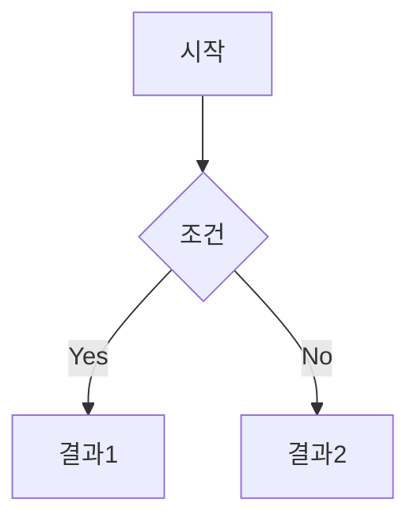
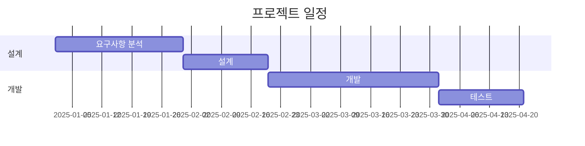

# Markdown 가이드

## 1. Markdown이란?

**Markdown**(마크다운)은 텍스트 기반의 경량 마크업 언어입니다. 읽기 쉽고 쓰기 쉬운 plain text 형식으로 작성한 문서를 HTML 등으로 변환할 수 있습니다.

### 주요 특징
- 간단하고 직관적인 문법
- 순수 텍스트 파일로 작성 가능
- 버전 관리 시스템과 호환성 우수
- 다양한 플랫폼 지원 (GitHub, Obsidian, Notion 등)
- HTML로 쉽게 변환 가능

### Obsidian에서의 Markdown
Obsidian은 **Markdown**을 기본 형식으로 사용하며, 추가 기능들을 지원합니다.

---

## 2. 제목 (Headers)

### 2.1 기본 문법

```markdown
# 제목 1 (H1)
## 제목 2 (H2)
### 제목 3 (H3)
#### 제목 4 (H4)
##### 제목 5 (H5)
###### 제목 6 (H6)
```

### 2.2 대체 문법 (H1, H2만)

```markdown
제목 1
======

제목 2
------
```

### 2.3 팁
- `#` 뒤에는 반드시 공백을 넣어야 합니다
- 제목은 계층 구조를 유지하는 것이 좋습니다 (H1 → H2 → H3)
- Obsidian에서는 제목을 기반으로 목차가 자동 생성됩니다

---

## 3. 텍스트 강조

### 3.1 기본 스타일

| 문법 | 렌더링 | 설명 |
|------|--------|------|
| `*이탤릭*` 또는 `_이탤릭_` | *이탤릭* | 기울임 |
| `**볼드**` 또는 `__볼드__` | **볼드** | 굵게 |
| `***볼드이탤릭***` | ***볼드이탤릭*** | 굵은 기울임 |
| `~~취소선~~` | ~~취소선~~ | 취소선 |
| `==하이라이트==` | ==하이라이트== | 형광펜 (Obsidian) |

### 3.2 혼합 사용

```markdown
**볼드 안에 *이탤릭* 넣기**
*이탤릭 안에 **볼드** 넣기*
***모두 적용***
```

---

## 4. 목록 (Lists)

### 4.1 순서 없는 목록 (Unordered List)

```markdown
- 항목 1
- 항목 2
  - 하위 항목 2.1
  - 하위 항목 2.2
- 항목 3
```

**대체 문법:** `-`, `*`, `+` 모두 사용 가능

### 4.2 순서 있는 목록 (Ordered List)

```markdown
1. 첫 번째
2. 두 번째
3. 세 번째
   1. 하위 항목 3.1
   2. 하위 항목 3.2
4. 네 번째
```

### 4.3 체크리스트 (Task List)

```markdown
- [ ] 미완료 항목
- [x] 완료 항목
- [ ] 또 다른 미완료 항목
```

---

## 5. 링크 (Links)

### 5.1 기본 링크

```markdown
[링크 텍스트](https://example.com)
[링크에 제목 추가](https://example.com "마우스 오버 시 표시")
```

### 5.2 URL 자동 링크

```markdown
<https://example.com>
<email@example.com>
```

### 5.3 참조 링크

```markdown
[링크 텍스트][참조ID]

[참조ID]: https://example.com "제목"
```

### 5.4 Obsidian 내부 링크

```markdown
[[다른 노트 이름]]
[[다른 노트#특정 섹션]]
[[다른 노트|표시할 텍스트]]
```

### 5.5 앵커 링크 (같은 문서 내)

```markdown
[특정 섹션으로 이동](#섹션-제목)
```

---

## 6. 이미지 (Images)

### 6.1 기본 문법

```markdown


```

### 6.2 참조 이미지

```markdown
![대체 텍스트][이미지참조]

[이미지참조]: https://example.com/image.png "이미지 제목"
```

### 6.3 Obsidian 이미지 삽입

```markdown
![[image.png]]
![[image.png|100]]  # 너비 100px
![[image.png|100x200]]  # 너비 100px, 높이 200px
```

### 6.4 이미지 링크

```markdown
[](링크_URL)
```

---

## 7. 코드 (Code)

### 7.1 인라인 코드

```markdown
`코드`를 문장 안에 삽입
```

렌더링: `코드`를 문장 안에 삽입

### 7.2 코드 블록

**백틱 사용:**
````markdown
```python
def hello():
    print("Hello, World!")
```
````

**들여쓰기 사용 (4칸 또는 탭):**
```markdown
    def hello():
        print("Hello, World!")
```

### 7.3 문법 강조 (Syntax Highlighting)

````markdown
```python
import numpy as np

def calculate(x, y):
    return x + y
```

```javascript
const greeting = "Hello, World!";
console.log(greeting);
```

```bash
#!/bin/bash
echo "Hello, World!"
```
````

### 7.4 지원 언어

- `python`, `javascript`, `java`, `c`, `cpp`, `csharp`
- `ruby`, `go`, `rust`, `php`, `swift`, `kotlin`
- `html`, `css`, `scss`, `json`, `xml`, `yaml`
- `sql`, `bash`, `powershell`, `shell`
- `markdown`, `latex`, `matlab`, `r`

---

## 8. 인용문 (Blockquotes)

### 8.1 기본 인용

```markdown
> 이것은 인용문입니다.
> 여러 줄에 걸쳐 작성할 수 있습니다.
```

렌더링:
> 이것은 인용문입니다.
> 여러 줄에 걸쳐 작성할 수 있습니다.

### 8.2 중첩 인용

```markdown
> 첫 번째 레벨
>> 두 번째 레벨
>>> 세 번째 레벨
```

### 8.3 인용문 안에 다른 요소

```markdown
> ## 인용문 안의 제목
> 
> - 목록 항목 1
> - 목록 항목 2
> 
> **볼드 텍스트**와 *이탤릭 텍스트*도 가능
```

---

## 9. 수평선 (Horizontal Rules)

```markdown
---

***

___
```

모두 같은 결과:

---

**팁:** 수평선 위아래로 빈 줄을 두는 것이 좋습니다.

---

## 10. 표 (Tables)

### 10.1 기본 표

```markdown
| 헤더1 | 헤더2 | 헤더3 |
|-------|-------|-------|
| 데이터1 | 데이터2 | 데이터3 |
| 데이터4 | 데이터5 | 데이터6 |
```

렌더링:

| 헤더1 | 헤더2 | 헤더3 |
|-------|-------|-------|
| 데이터1 | 데이터2 | 데이터3 |
| 데이터4 | 데이터5 | 데이터6 |

### 10.2 정렬

```markdown
| 왼쪽 정렬 | 가운데 정렬 | 오른쪽 정렬 |
|:----------|:-----------:|-----------:|
| 왼쪽 | 가운데 | 오른쪽 |
| A | B | C |
```

렌더링:

| 왼쪽 정렬 | 가운데 정렬 | 오른쪽 정렬 |
|:----------|:-----------:|-----------:|
| 왼쪽 | 가운데 | 오른쪽 |
| A | B | C |

### 10.3 표 안에 다른 요소

```markdown
| 항목 | 설명 |
|------|------|
| **볼드** | `코드` |
| *이탤릭* | [링크](https://example.com) |
```

---

## 11. 각주 (Footnotes)

### 11.1 기본 각주

```markdown
여기에 각주를 넣습니다[^1].

또 다른 각주입니다[^note].

[^1]: 이것은 첫 번째 각주입니다.
[^note]: 이것은 이름이 있는 각주입니다.
```

### 11.2 인라인 각주 (Obsidian)

```markdown
인라인 각주^[각주 내용을 바로 작성]를 사용할 수 있습니다.
```

---

## 12. 정의 목록 (Definition Lists)

```markdown
용어 1
: 정의 1

용어 2
: 정의 2a
: 정의 2b
```

---

## 13. 이스케이프 (Escape)

특수 문자를 문자 그대로 표시하려면 백슬래시 `\`를 사용:

```markdown
\*별표\*
\# 해시
\[ 대괄호 \]
```

렌더링: \*별표\* \# 해시 \[ 대괄호 \]

**이스케이프가 필요한 문자:**
```
\ ` * _ { } [ ] ( ) # + - . ! |
```

---

## 14. HTML 사용

Markdown 안에 HTML을 직접 사용할 수 있습니다:

```markdown
<div style="color: red;">
  빨간색 텍스트
</div>

<details>
<summary>클릭하여 펼치기</summary>
숨겨진 내용
</details>
```

### 14.1 유용한 HTML 태그

**색상:**
```html
<span style="color: red;">빨간색</span>
<span style="color: blue;">파란색</span>
```

**중앙 정렬:**
```html
<center>가운데 정렬</center>
```

**밑줄:**
```html
<u>밑줄 텍스트</u>
```

**위첨자/아래첨자:**
```html
H<sub>2</sub>O (물)
x<sup>2</sup> (제곱)
```

---

## 15. Obsidian 고급 기능

### 15.1 Callouts (콜아웃)

```markdown
> [!note]
> 이것은 노트 콜아웃입니다.

> [!warning]
> 경고 메시지입니다.

> [!tip]
> 팁을 알려드립니다.

> [!danger]
> 위험한 내용입니다.

> [!info]
> 정보를 제공합니다.
```

**접을 수 있는 콜아웃:**
```markdown
> [!note]- 제목
> 접힌 내용

> [!tip]+ 제목
> 펼쳐진 내용
```

### 15.2 임베드 (Embed)

**노트 임베드:**
```markdown
![[다른 노트 이름]]
![[다른 노트#특정 섹션]]
```

**PDF 임베드:**
```markdown
![[문서.pdf]]
![[문서.pdf#page=5]]  # 5페이지 표시
```

### 15.3 태그 (Tags)

```markdown
#태그
#태그/하위태그
#multi-word-tag
```

### 15.4 메타데이터 (YAML Front Matter)

```markdown
---
title: 문서 제목
tags: [python, 반도체, klayout]
date: 2025-10-06
author: 작성자
---

본문 시작...
```

### 15.5 수식 (LaTeX)

**인라인 수식:**
```markdown
$E = mc^2$
```

**블록 수식:**
```markdown
$$
\frac{-b \pm \sqrt{b^2 - 4ac}}{2a}
$$
```

### 15.6 Mermaid 다이어그램

````markdown

````

**순서도:**
````markdown

````

**간트 차트:**
````markdown

````

---

## 16. 반도체/Klayout 관련 사용 예시

### 16.1 측정 데이터 표

```markdown
| Point | Thickness (nm) | Rs (Ω/sq) | 비고 |
|:-----:|:--------------:|:---------:|:----:|
| 1 | 150.5 | 0.234 | Center |
| 2 | 148.3 | 0.241 | Edge |
| 3 | 152.1 | 0.228 | - |
```

### 16.2 공정 체크리스트

```markdown
## 증착 공정 체크리스트

- [x] 챔버 클리닝
- [x] 기판 준비
- [x] Ti 증착 (10nm)
- [x] TiN 증착 (20nm)
- [ ] W 증착 (가변)
- [ ] 면저항 측정
- [ ] 두께 측정
```

### 16.3 코드 문서화

````markdown
## Klayout Python 스크립트

```python
import pya

# Layout 로드
layout = pya.Layout()
layout.read("input.gds")

# Layer 정의
layer_metal = layout.layer(10, 0)

# Cell 가져오기
top_cell = layout.top_cell()
```

**주요 함수:**
- `layout.read()`: GDS 파일 읽기
- `layout.layer()`: 레이어 정의
- `layout.top_cell()`: 최상위 셀 가져오기
````

### 16.4 프로세스 플로우

```markdown
## 박막 증착 프로세스

1. **전처리**
   - 기판 세정
   - 오염 제거
   
2. **증착**
   - Ti 10nm @ 200°C
   - TiN 20nm @ 350°C
   - W 가변 @ 400°C
   
3. **후처리**
   - Annealing (선택)
   - 측정
```

---

## 17. 마크다운 스타일 가이드

### 17.1 일관성 유지

**좋은 예:**
```markdown
- 항목 1
- 항목 2
- 항목 3
```

**나쁜 예 (혼용하지 말 것):**
```markdown
- 항목 1
* 항목 2
+ 항목 3
```

### 17.2 가독성

**좋은 예:**
```markdown
# 제목

본문 내용...

## 부제목

더 많은 내용...
```

**나쁜 예 (빈 줄 없음):**
```markdown
# 제목
본문 내용...
## 부제목
더 많은 내용...
```

### 17.3 링크 정리

복잡한 문서에서는 참조 링크 사용:

```markdown
[Google][1]에서 검색하거나 [GitHub][2]에서 확인하세요.

[1]: https://google.com
[2]: https://github.com
```

---

## 18. 단축키 (Obsidian)

| 기능 | Windows/Linux | Mac |
|------|---------------|-----|
| 볼드 | `Ctrl + B` | `Cmd + B` |
| 이탤릭 | `Ctrl + I` | `Cmd + I` |
| 링크 삽입 | `Ctrl + K` | `Cmd + K` |
| 코드 블록 | `Ctrl + Shift + C` | `Cmd + Shift + C` |
| 체크리스트 | `Ctrl + L` | `Cmd + L` |

---

## 19. 마크다운 변환 도구

### 19.1 온라인 에디터
- [StackEdit](https://stackedit.io/)
- [Dillinger](https://dillinger.io/)
- [HackMD](https://hackmd.io/)

### 19.2 변환 도구
- **Pandoc**: 다양한 형식 변환
- **Markdown to PDF**: PDF 변환
- **Typora**: WYSIWYG 마크다운 에디터

### 19.3 Python 라이브러리

```python
# Markdown to HTML
import markdown

md_text = "# Hello World"
html = markdown.markdown(md_text)
print(html)  # <h1>Hello World</h1>
```

---

## 20. 실전 팁

### 20.1 문서 템플릿

**회의록 템플릿:**
```markdown
---
title: 회의록
date: 2025-10-06
participants: [참석자1, 참석자2]
tags: [회의, 프로젝트명]
---

## 회의 정보
- **일시**: 2025-10-06 14:00
- **장소**: 회의실
- **참석자**: 

## 안건
1. 
2. 
3. 

## 논의 내용

## 결정 사항
- [ ] 

## 다음 액션
- [ ] 
```

**실험 노트 템플릿:**
```markdown
---
title: 실험명
date: 2025-10-06
tags: [실험, 반도체]
---

## 실험 목적

## 실험 조건
| 항목 | 값 |
|------|-----|
| 온도 | |
| 압력 | |
| 시간 | |

## 실험 결과

## 분석

## 결론
```

### 20.2 빠른 입력

**약어 사용:**
```markdown
*[HTML]: Hyper Text Markup Language
*[CSS]: Cascading Style Sheets

HTML과 CSS를 배웁니다.
```

### 20.3 파일 구조

```
프로젝트/
├── README.md          # 프로젝트 소개
├── docs/
│   ├── guide.md       # 사용 가이드
│   └── api.md         # API 문서
├── notes/
│   ├── 2025-10-06.md  # 일일 노트
│   └── ideas.md       # 아이디어
└── attachments/       # 첨부 파일
    └── images/
```

---

## 21. 자주 하는 실수

### 21.1 띄어쓰기 누락

❌ **잘못된 예:**
```markdown
#제목
-항목
```

✅ **올바른 예:**
```markdown
# 제목
- 항목
```

### 21.2 목록 들여쓰기

❌ **잘못된 예:**
```markdown
- 항목 1
 - 하위 항목 (공백 1개)
```

✅ **올바른 예:**
```markdown
- 항목 1
  - 하위 항목 (공백 2개 또는 탭)
```

### 21.3 코드 블록 닫기

❌ **잘못된 예:**
````markdown
```python
code
``
````

✅ **올바른 예:**
````markdown
```python
code
```
````

---

## 22. 참고 자료

### 공식 문서
- [Markdown Guide](https://www.markdownguide.org/)
- [CommonMark Spec](https://commonmark.org/)
- [Obsidian Help](https://help.obsidian.md/)
- [GitHub Flavored Markdown](https://github.github.com/gfm/)

### 치트시트
- [Markdown Cheatsheet](https://github.com/adam-p/markdown-here/wiki/Markdown-Cheatsheet)
- [Obsidian Formatting](https://help.obsidian.md/Editing+and+formatting/Basic+formatting+syntax)

---

**작성일**: 2025-10-06  
**버전**: 1.0  
**태그**: #markdown #문서작성 #obsidian #가이드
